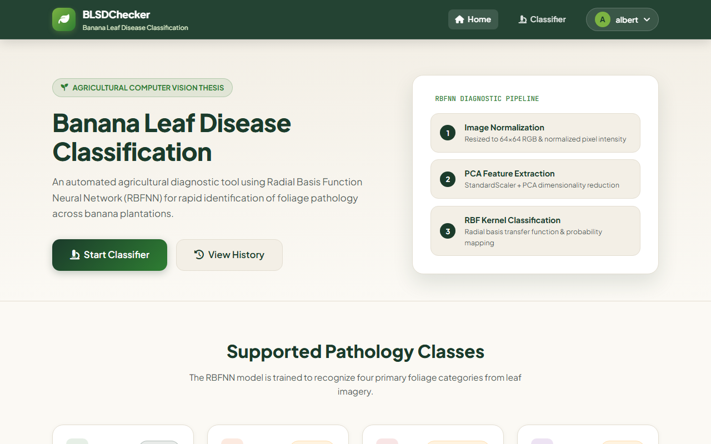
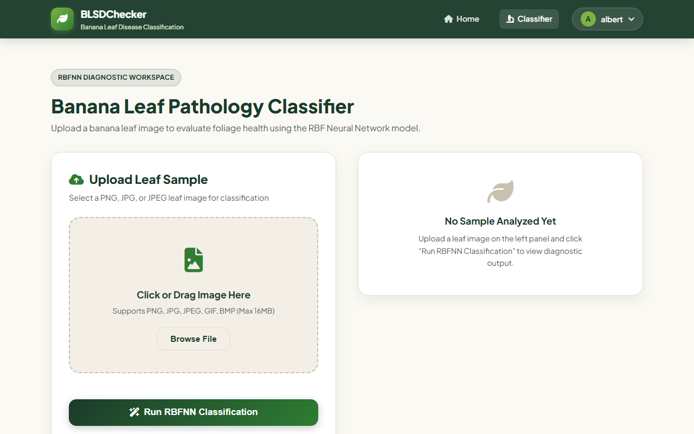
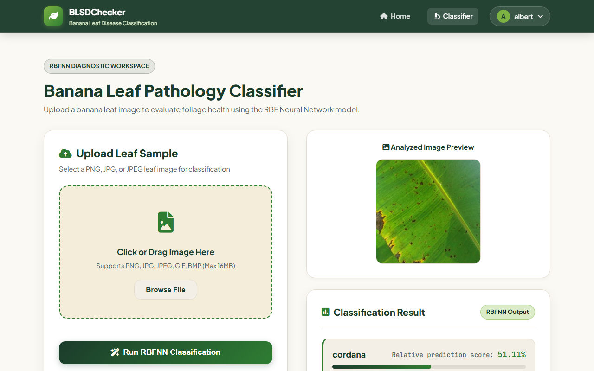
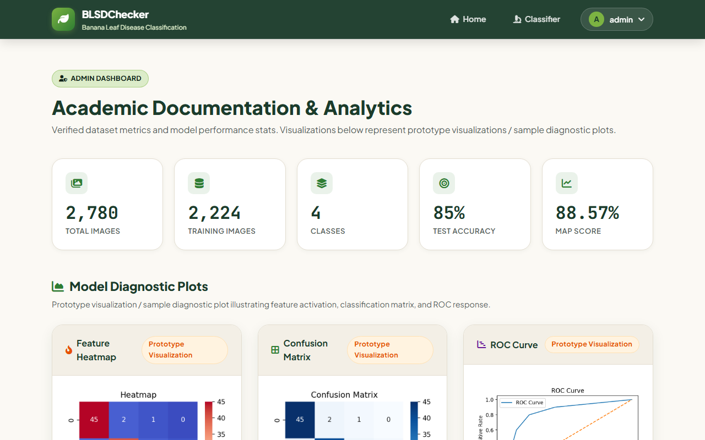

# BLSDChecker
### Banana Leaf Disease Classification using RBF Neural Network

BLSDChecker is an intelligent agricultural web prototype designed to classify banana leaf health conditions using a custom Radial Basis Function Neural Network (RBFNN). The application features an interactive Flask web interface for single-image diagnosis, historical analysis tracking, user authentication, and administrator analytical documentation.

---

## 📌 Features

- **Image Upload & Inference**: Upload leaf photos for automated disease classification.
- **Relative Score Analysis**: Displays relative prediction probabilities for the top identified classes.
- **Diagnostic History**: Logged-in users can review, inspect, and manage past prediction records.
- **User Authentication**: Secure user registration, authentication, session control, and role management.
- **Admin Documentation**: Administrator view for system validation, confusion matrix heatmaps, ROC curves, and performance evaluation.

---

## 🍃 Supported Classes

The system is trained to evaluate four distinct banana leaf health categories:

1. **Healthy**: Normal leaf tissue without visible infection.
2. **Sigatoka**: Leaf spot condition caused by *Mycosphaerella* fungi.
3. **Pestalotiopsis**: Fungal leaf spot and blight condition.
4. **Cordana**: Cordana leaf spot disease caused by *Cordana musae*.

---

## ⚙️ Technical Workflow

The machine learning inference pipeline processes incoming leaf images through the following steps:

```
Input Image ➔ Image Resize (64x64) ➔ RGB Normalization [0, 1] ➔ StandardScaler ➔ PCA Dimensionality Reduction ➔ RBF Neural Network (RBFNN)
```

1. **Pre-processing**: Images are resized to `64×64` resolution and converted to RGB color format.
2. **Normalization**: Pixel intensities are normalized to the `[0, 1]` range.
3. **Feature Scaling**: Flattened vectors are standardized using `StandardScaler`.
4. **Dimensionality Reduction**: Principal Component Analysis (`PCA`) extracts essential variance features.
5. **RBFNN Classifier**: Custom Radial Basis Function network computes distance activations across RBF centers, passing hidden representations to a Ridge-regularized output layer with Softmax probability normalization.

---

## 📊 Validated Project Metrics

| Metric | Value |
| :--- | :--- |
| **Total Dataset Size** | 2,780 images |
| **Training Set** | 2,224 images |
| **Classes Evaluated** | 4 classes |
| **Test Accuracy** | 85.00% |
| **mAP Score** | 88.57% |

---

## 🛠️ Tech Stack

- **Backend**: Python, Flask, Werkzeug
- **Machine Learning & Signal Processing**: OpenCV (`cv2`), NumPy, SciPy, scikit-learn, joblib
- **Database**: SQLite3
- **Data Visualization**: Matplotlib, Seaborn
- **Frontend**: HTML5, Vanilla CSS3, JavaScript (ES6)

---

## 📁 Repository & Artifact Exclusions

To maintain clean repository hygiene, large dataset archives, trained model checkpoints, local user database records, and temporary uploads are explicitly excluded from this public repository:

- **Datasets & Raw Images**: 2,780 dataset images are kept locally.
- **Trained Model Artifacts**: Serialized `.pkl` model, scaler, PCA transformer, and label encoder weights (`model/*.pkl`) are omitted.
- **Database File**: Local database instances (`database.db`) are excluded.
- **User Uploads & Generated Outputs**: Dynamic uploads (`static/uploads/`) and generated plots (`static/plots/*.png`) are ignored.

*(Place model weights inside the `model/` folder before starting inference in a production or local testing environment.)*

---

## 🚀 Local Installation & Setup

### 1. Prerequisites
- Python `3.9` or higher installed on your system.

### 2. Clone Repository & Setup Virtual Environment
```bash
git clone https://github.com/albertwillyamzh/blsd-checker.git
cd blsd-checker

# Create virtual environment
python -m venv venv

# Activate virtual environment
# On Windows (PowerShell):
.\venv\Scripts\Activate.ps1
# On macOS/Linux:
source venv/bin/activate
```

### 3. Install Dependencies
```bash
pip install -r requirements.txt
```

### 4. Configure Environment Variables
Copy `.env.example` to create your local `.env` configuration:
```bash
cp .env.example .env
```

### 5. Run Application
```bash
python app.py
```
Open your browser and navigate to `http://127.0.0.1:5000` to access the application.

---

## 📸 Screenshots

### Home Page


### Classification Workspace


### Prediction Results & Relative Score Analysis


### Administrator Evaluation Documentation


---

## ⚠️ Academic & Research Disclaimer

> **Academic Research Notice**: BLSDChecker is an educational thesis research prototype developed for non-clinical agricultural experimentation and academic demonstration. Predictions should be verified by agricultural extension specialists or plant pathologists.

---

## 📄 License

Distributed under the MIT License. See [LICENSE](LICENSE) for more information.
